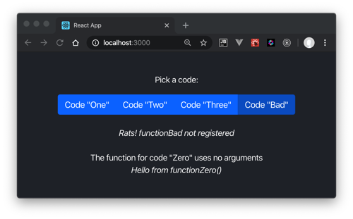

# Dynamic Function Dispatching

This demo addresses a need to dynamically call a JavaScript function by a string name.
Approaches using `Eval` or `Function` are not allowed. 

Instead, we use a JavaScript object to map a string key to a function name
in a factory pattern. Here is `functionFactory.js`:

```javascript
import functionOne from './dynamic/functionOne';
import functionTwo from './dynamic/functionTwo';
import functionThree from './dynamic/functionThree';
import functionZero from './dynamic/functionZero';

// To add a function: add its import above; then add a line for its name here:
const functionMap = {
    functionOne,
    functionTwo,
    functionThree,
    functionZero,
};

const resolve = (functionName, args) => {
    const fn = functionMap[functionName];
    return fn
        ? fn(args)
        : `Rats! ${functionName} not registered`;
};

export function functionFactory(code, args = {}) {
    return resolve(`function${code}`, args);
}
```

A caller would invoke a function by a `code` parameter string in this manner.
Parameter signatures are a contract between the caller and the target function.
We sends zero or more target-specific arguments via an
`args` object. Here's the demo sending three arguments in the factory's
second parameter, an object containing key/value arguments.

```javascript
functionFactory(code, {arg1: new Date().toTimeString(), arg2: 'value2', arg3: 'value3'})
```
That parameter object is optional, defaulting to `{}`. Again, argument
signature is an agreement between caller and target.

```javascript
functionFactory('Zero')
```

Here is one demo dynamic target function:

```javascript
export default function functionOne(args) {
    const { arg1, arg2, arg3 } = { ...args };
    return `Hello from functionOne('${arg1}', '${arg2}', '${arg3}')`;
}
```

The demo UI chooses the target's code property via toggle buttons.


The factory defaults unregistered functions.



---
# Instructions

This project was bootstrapped with [Create React App](https://github.com/facebook/create-react-app).

## Available Scripts

In the project directory, you can run:

### `yarn start`

Runs the app in the development mode.<br />
Open [http://localhost:3000](http://localhost:3000) to view it in the browser.

The page will reload if you make edits.<br />
You will also see any lint errors in the console.

### `yarn test`

Launches the test runner in the interactive watch mode.<br />
See the section about [running tests](https://facebook.github.io/create-react-app/docs/running-tests) for more information.

### `yarn build`

Builds the app for production to the `build` folder.<br />
It correctly bundles React in production mode and optimizes the build for the best performance.

The build is minified and the filenames include the hashes.<br />
Your app is ready to be deployed!

See the section about [deployment](https://facebook.github.io/create-react-app/docs/deployment) for more information.
