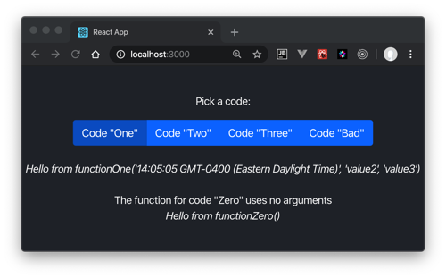
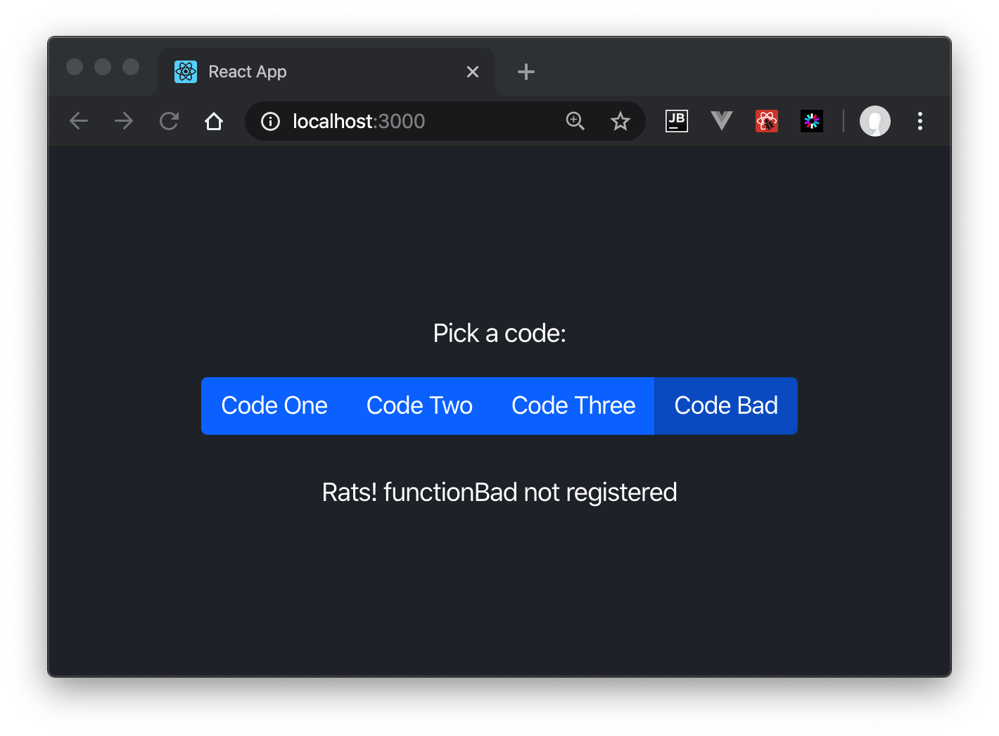

# Dynamic Function Dispatching

This demo addresses a need to dynamically call a JavaScript function by a string name.
Approaches using `Eval` or `Function` are not allowed. 

Instead, we use a JavaScript object to map a string key to a function name
in a factory pattern. Here is `functionFactory.js`:

```javascript
import functionOne from './dynamic/functionOne';
import functionTwo from './dynamic/functionTwo';
import functionThree from './dynamic/functionThree';

// To add a function: add its import above; then add a line for its name here:
const functionMap = {
    functionOne,
    functionTwo,
    functionThree,
};

const dispatchFunction = (functionNAme, param) => {
    const fn = functionMap[functionNAme];
    return fn ? fn(param) : `Rats! ${functionNAme} not registered`;
};

export function functionFactory(code, param) {
    return dispatchFunction(`function${code}`, param);
}
```

A caller would invoke a function by a `code` parameter string in this manner:

```javascript
functionFactory(code, new Date().toTimeString())
```

The param property is our single parameter, but we could have coded for more
parameters.

Here is one demo dynamic function:

```javascript
export default function functionThree(time) {
    return `Hello from function THREE at ${time}`;
}
```

The demo UI chooses the dispatch code property via toggle buttons.



The factory handles unregistered functions.



---
# Instructions

This project was bootstrapped with [Create React App](https://github.com/facebook/create-react-app).

## Available Scripts

In the project directory, you can run:

### `yarn start`

Runs the app in the development mode.<br />
Open [http://localhost:3000](http://localhost:3000) to view it in the browser.

The page will reload if you make edits.<br />
You will also see any lint errors in the console.

### `yarn test`

Launches the test runner in the interactive watch mode.<br />
See the section about [running tests](https://facebook.github.io/create-react-app/docs/running-tests) for more information.

### `yarn build`

Builds the app for production to the `build` folder.<br />
It correctly bundles React in production mode and optimizes the build for the best performance.

The build is minified and the filenames include the hashes.<br />
Your app is ready to be deployed!

See the section about [deployment](https://facebook.github.io/create-react-app/docs/deployment) for more information.
